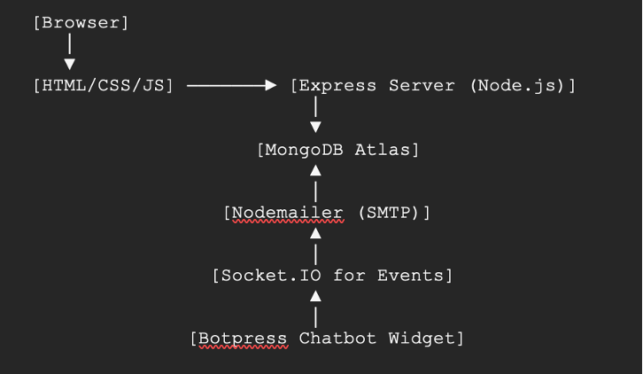

Software Requirements Specification (SRS)
Project Title: Victoria Multi Speciality Hospital Appointment Booking Platform

1. Introduction     // Contributed by Aishwarya

    1.1 Purpose
    The Victoria Multi Speciality Hospital Appointment Booking System is designed to streamline the process of managing patient appointments online for a multi-speciality hospital. This project allows patients to easily schedule, cancel, and reschedule appointments while ensuring that time slots are not double-booked. It includes secure login, real-time data syncing across clients, chatbot support, and email confirmations. The platform also aims to reduce administrative workload and improve patient convenience.

    1.2 Scope
    This project implements a web-based appointment management system for patients. Users can register, log in, and manage their appointments using a visually clean dashboard. The system dynamically disables already-booked time slots, supports email confirmations on all appointment actions, and integrates a chatbot to assist users in real-time. The project uses a centralized MongoDB Atlas database to support concurrent access from multiple users on different devices.

2. System Overview   // Contributed by Aishwarya
    •	Frontend: HTML, CSS, JavaScript
    •	Backend: Node.js, Express.js
    •	Database: MongoDB Atlas
    •	Authentication: JSON Web Tokens (JWT)
    •	Real-Time Updates: Socket.IO
    •	Email: Nodemailer
    •	Chatbot: Botpress Cloud Integration
    •	Testing: Selenium WebDriver
    •	Deployment: Local server + remote MongoDB (MongoDB Atlas)

3. Functional Requirements

    3.1 User Registration and Login  // Contributed by Gayathri, Kavisha
    •	User can register with name, email, and password
    •	Passwords are securely hashed
    •	JWT tokens are used to maintain sessions
    •	Client stores userId in localStorage to access personalized data

    3.2 Book Appointment   // Contributed by Anjali, Gayathri
    •	Booking form captures:
        o	Name, age, phone number, gender
        o	Department (Cardiology, Pediatrics, etc.)
        o	Service (Consultation, Checkup, Therapy)
        o	Date and time
    •	Age is selected via dropdown (1–100)
    •	Already-booked time slots are automatically disabled
    •	Booked appointments are saved to MongoDB
    •	Email confirmation is sent using Nodemailer
    •	Socket.IO emits appointment:booked event to all clients

    3.3 Cancel Appointment  // Contributed by Kavisha, Gayathri
    •	Users can cancel a previously booked appointment
    •	Cancelled appointments are not shown on the dashboard
    •	Cancellation triggers an email and emits appointment:cancelled

    3.4 Reschedule Appointment  // Contributed by Kavisha, Gayathri
    •	Users can select new date and time
    •	Booked time slots are disabled dynamically
    •	Updates status to rescheduled in the database
    •	Rescheduling triggers confirmation email
    •	Socket.IO emits appointment:rescheduled

    3.5 View Dashboard  // Contributed by Anjali, Vedantha
    •	Displays a list of all active appointments
    •	Appointments show all details: name, phone, age, gender, date, service, time, and status
    •	Includes search bar to filter appointments by service or date
    •	Real-time updates reflected immediately on any client logged in

    3.6 Real-Time Synchronization    // Contributed by Vedantha
    •	Implemented using Socket.IO
    •	When any user books, cancels, or reschedules, the update is instantly reflected on all client dashboards
    •	Ensures consistency and prevents double-booking

    3.7 Chatbot Support      // Contributed by Aishwarya
    •	Botpress widget embedded on dashboard
    •	Helps users with basic queries such as hospital services, appointment steps, emergency info
    •	Pre-trained with hospital-specific intents and FAQs
    •	Future enhancements can include fallback to human support

    3.8 Email Integration   // Contributed by Gayathri
    •	Email integration is handled using Nodemailer for all appointment actions
    •	Booking, cancellation, and rescheduling each trigger a customized confirmation email
    •	Emails contain key details like patient name, service, department, and time
    •	Secure SMTP configuration is stored in the .env file and excluded from version control
    •	Emails provide users with clear confirmations and act as a communication log
    •	Tightly integrated with Socket.IO events for real-time user feedback and synchronization

4. Non-Functional Requirements

    4.1 Usability   // Contributed by Anjali, Vedantha
    •	User-friendly UI with responsive layout
    •	Error messages and alerts to guide user actions

    4.2 Availability     // Contributed by Aishwarya, Vedantha
    •	MongoDB Atlas ensures high availability for data
    •	Real-time updates allow multiple users to interact concurrently

    4.3 Security    // Contributed by Gayathri
    •	Passwords are stored securely using hashing
    •	Sessions are managed using JWT
    •	Environment variables like DB URI and email credentials are stored in .env and excluded from version control

    4.4 Maintainability      // Contributed by Aishwarya, Vedantha
    •	Modular project structure using Express routes, MongoDB models
    •	Easily extendable for admin panel and role-based access

5. Testing Plan

    5.1 Testing Tool: Selenium  // Contributed by Kavisha
    •	End-to-end UI testing using Selenium WebDriver
    •	Simulate login, booking, cancellation, and form validations
    •	Verifies real-time updates and element visibility
    •	Cross-browser testing with Chrome and Firefox

    5.2 Test Scenarios       // Contributed by Aishwarya
    •	Valid user registration and login
    •	Disabled time slots after booking
    •	Booking appointment → verify email received
    •	Cancel and reschedule → verify dashboard updates
    •	Chatbot interaction

6. System Design Diagram     // Contributed by Vedantha

7. Use Cases        // Contributed by everyone

    Use Case 1: Register/Login
    • Actor: User
    • Description: A patient registers with name, email, and password or logs in with
    existing credentials.

    Use Case 2: Book Appointment
    • Actor: Logged-in User
    • Description: User selects service, date, time, provides contact details, and
    submits. Appointment is saved and confirmation email sent.

    Use Case 3: View/Manage Appointments
    • Actor: User
    • Description: User views a list of upcoming and past appointments, with options to
    cancel or reschedule.

8. User Flow    // Contributed by Vedantha

    Patient/User Flow:
    1. User lands on the Victoria Multi Speciality Hospital homepage.
    2. Clicks on “Login” or “Register”.
    3. If new, registers with name, email, and password.
    4. On successful login, redirected to personal dashboard.
    5. Clicks on “Book Appointment” to open the booking form.
    6. Fills in:
    •	Name of person for appointment
    •	Phone Number
    •	Age
    •	Gender
    •	Department
    •	Service
    •	Date
    •	Time
    7. Returns to Dashboard to view/manage appointments.
    8. User will receive email from hospital about confirmation.
    9. User can logout.
    10. After logout, user redirected to login page.

9. Future Enhancements  // Contributed by Kavisha
    •	Admin dashboard for hospital staff
    •	Export reports as PDF or CSV
    •	Multi-language chatbot support
    •	Cloud deployment (Render, Railway, or Vercel)

10. Team Contributions
    Name of the member	                                    Main Role
    Venkata Naga Sai Aishwarya Naidu	            Team Lead, Core Developer,  Real-time integrator
    Sannithi Anjali	                                Frontend Developer, UI/UX & Documentation Lead
    Rayudu Lakshmi Gayathri	                        Backend Developer, Security & Email Integrator
    Vedantha Suddula	                            Full-stack Developer, Frontend & Booking Flow Specialist
    Kavisha Savla	                                Full-Stack Developer, Test Lead

11. References
    •	MongoDB Atlas. https://www.mongodb.com/atlas
    •	Nodemailer Docs. https://nodemailer.com
    •	Socket.IO. https://socket.io
    •	Botpress Webchat. https://botpress.com
    •	Selenium Documentation. https://www.selenium.dev/documentation

